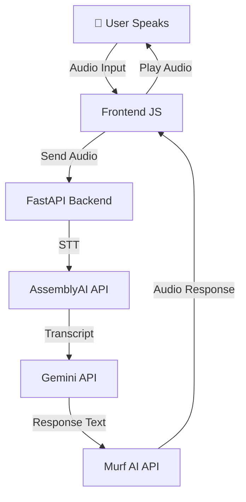
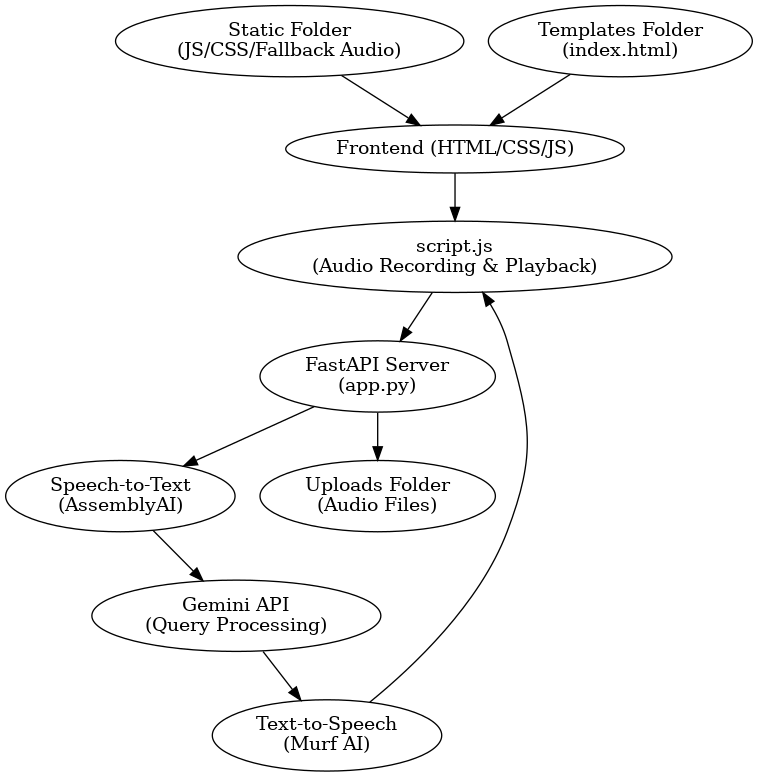
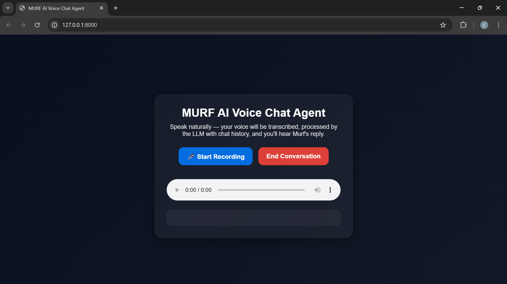

# MURF AI-Powered Voice Agent

An interactive AI-powered voice assistant that converts speech to text (STT), processes it with a Large Language Model (LLM), and responds with natural text-to-speech (TTS).  
The project integrates Murf AI for voice synthesis, AssemblyAI for transcription, and Google's Gemini API for intelligent responses.

## 🚀 Features

- 🎙 **Speech to Text (STT)**: Converts voice input into accurate text using AssemblyAI.
- 🧠 **Conversational Memory**: Maintains chat history for contextual responses.
- 🤖 **LLM Integration**: Uses Gemini API for intelligent replies.
- 🔊 **Text to Speech (TTS)**: Converts AI responses into natural-sounding audio using Murf AI.
- 💾 **Session Management**: Session IDs to store conversation context.
- 🎨 **Modern UI**: Glassmorphism-inspired front-end design.
- 📂 **Multi-format Input Support**: Can handle audio inputs (WAV) and return audio or fallback responses.

## 🛠 Tech Stack

**Frontend:**

- HTML5, CSS3 (Glassmorphism styling)
- JavaScript (MediaRecorder API)

**Backend:**

- Python (FastAPI)
- Murf AI API (TTS)
- AssemblyAI API (STT)
- Google Gemini API (LLM)

**Other Tools:**

- FormData for file transfer
- Fetch API for backend communication

## 📂 Project Structure

```plaintext
project-root/
|── assets/
│── static/
│   ├── script.js          # Frontend JS logic (recording, sending audio, handling responses)
│   ├── style.css          # Frontend styles
│── templates/
│   ├── index.html         # Main UI
│── uploads/               # Uploaded audio files
│── app.py                 # FastAPI backend
│── requirements.txt       # Python dependencies
│── .env                   # Environment variables
│── venv/                  # Virtual environment
```

## 🏗 Architecture



## ⚙ Setup Instructions

1. **Clone the repository**

   ```bash
   git clone <repo-url>
   cd <repo-folder>
   ```

2. **Create a virtual environment & activate it**

   ```bash
   python -m venv venv
   source venv\Scripts\activate
   ```

3. **Install dependencies**

   ```bash
   pip install -r requirements.txt
   ```

4. **Create a `.env` file**

   ```env
   MURF_API_KEY=your_murf_api_key
   ASSEMBLYAI_API_KEY=your_assemblyai_api_key
   GEMINI_API_KEY=your_gemini_api_key
   ```

5. **Run the server**

   ```bash
   uvicorn app:app --reload
   ```

6. **Open the UI**
   - Visit `http://127.0.0.1:8000` in your browser.

## 📸 Screenshots




---

💡 **Pro Tip**: Keep your API keys safe and never commit `.env` to version control.
