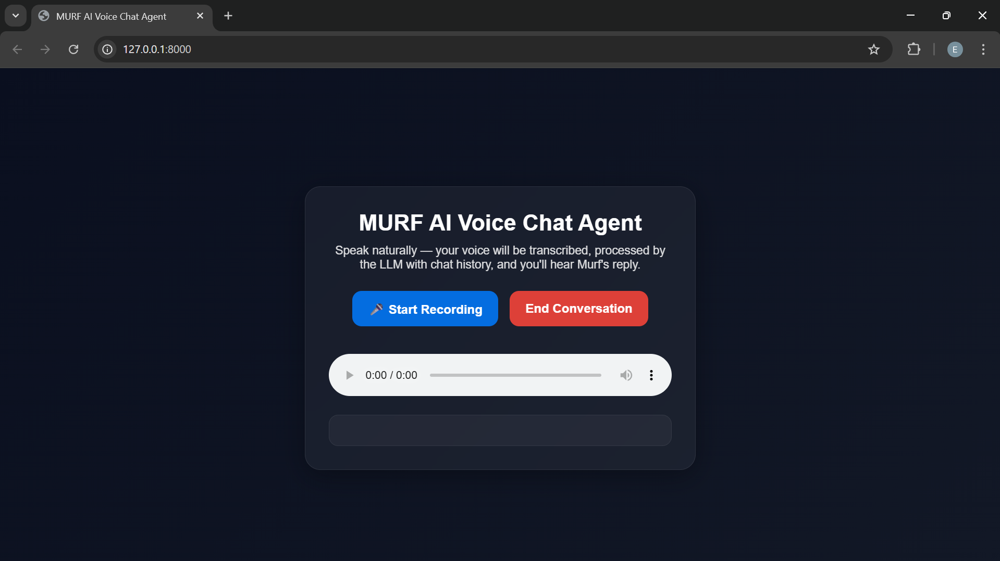
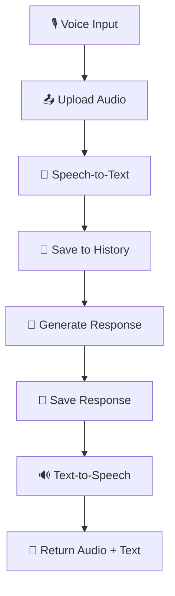

# 🎤 AI Voice Chat Agent

A sophisticated conversational AI agent that supports voice input and output, built with FastAPI and modern Python practices. The agent processes speech through a complete pipeline: Speech-to-Text → Language Model → Text-to-Speech, featuring Lady Victoria, a distinguished royal butler persona.

 

## ✨ Features

- 🎙️ **Real-time Voice Processing**: Live audio streaming with turn detection
- 🗣️ **Streaming TTS**: High-quality text-to-speech with buffered audio playback
- 💬 **Chat Memory**: Maintains conversation context across interactions
- 🌐 **Web Search Integration**: Real-time information retrieval via Tavily API
- 👑 **Persona-driven Responses**: Lady Victoria royal butler character
- 🔄 **WebSocket Communication**: Low-latency audio streaming
- 📊 **Comprehensive Logging**: Detailed logs for debugging and monitoring
- 🎛️ **Runtime API Configuration**: Set API keys through web interface

## 🛠️ Technology Stack

- **Backend**: FastAPI with Pydantic models and WebSocket support
- **Speech-to-Text**: AssemblyAI v3 Streaming API with turn detection
- **Language Model**: Google Gemini 2.5 Flash with streaming responses
- **Text-to-Speech**: Murf AI WebSocket streaming
- **Web Search**: Tavily API for live information
- **Frontend**: Vanilla JavaScript with Web Audio API and WebSocket

## 📋 Prerequisites

- Python 3.11+
- API Keys for:
  - Google Gemini API
  - Murf AI API
  - AssemblyAI API
  - Tavily API (for web search)

## 🚀 Quick Start

### 1. Clone the Repository

```bash
git clone https://github.com/yourusername/ai-voice-chat-agent.git
cd ai-voice-chat-agent
```

### 2. Set Up Environment

```bash
# Create virtual environment
python -m venv venv
source venv/Scripts/activate  # On Windows: venv\Scripts\activate

# Install dependencies
pip install -r requirements.txt
```

### 3. Configure Environment Variables

```bash
# Copy environment template
cp .env.example .env

# Edit .env with your API keys
GEMINI_API_KEY=your_gemini_api_key_here
MURF_API_KEY=your_murf_api_key_here
ASSEMBLYAI_API_KEY=your_assemblyai_api_key_here
TAVILY_API_KEY=your_tavily_api_key_here
```

### 4. Run the Application

```bash
# Using the runner script (recommended)
python run.py

# Or with uvicorn
uvicorn app:app --reload
```

### 5. Access the Interface

- Open in your browser
- Configure API keys in the web interface if not set in .env
- Click "Start Recording" to begin voice conversation

## 📁 Project Structure

```plaintext
voice-agent/
├── app.py                 # Main FastAPI application with WebSocket
├── config.py              # Configuration management
├── run.py                 # Development server runner
├── requirements.txt       # Python dependencies
├── .env.example           # Environment variables template
├── models/
│   ├── __init__.py
│   └── schemas.py         # Pydantic models
├── services/
│   ├── __init__.py
│   ├── stt_service.py     # Speech-to-Text service
│   ├── llm_service.py     # Language Model service (with web search)
│   ├── tts_service.py     # Text-to-Speech service (WebSocket streaming)
│   └── chat_service.py    # Chat history management
├── utils/
│   ├── __init__.py
│   └── logger.py          # Logging configuration
├── static/
│   ├── script.js          # Frontend JavaScript with audio buffering
│   └── style.css          # Modern glassmorphism UI styles
├── templates/
│   └── index.html         # HTML template
└── Agent/
    └── Output/            # Audio recording output directory
```

## 🏗️ Architecture Overview

The application follows a clean architecture pattern with separation of concerns:

### Services Layer

- **STTService**: Handles AssemblyAI speech-to-text operations
- **LLMService**: Manages Gemini API interactions with web search integration
- **TTSService**: Processes Murf AI text-to-speech with WebSocket streaming
- **ChatService**: Maintains conversation history

### Key Features

#### Real-time Voice Processing

- AssemblyAI v3 streaming with automatic turn detection
- WebSocket-based audio streaming at 16kHz
- Automatic conversation flow management

#### Intelligent Response Generation

- Lady Victoria persona with refined British butler character
- Web search integration for live information queries
- Streaming LLM responses for natural conversation flow

#### Advanced Audio Handling

- Murf AI WebSocket streaming for low-latency TTS
- Audio buffering and seamless playback
- WAV header stripping and PCM processing

#### Modern Web Interface

- Glassmorphism design with dark theme
- Real-time transcription display
- Voice visualizer with wave animations
- Runtime API key configuration

## 🔄 Data Flow


```mermaid
graph TD
    A[🎙️ Voice Input] --> B[📤 Upload Audio]
    B --> C[🎯 Speech-to-Text]
    C --> D[💾 Save to History]
    D --> E[🤖 Generate Response]
    E --> F[💾 Save Response]
    F --> G[🔊 Text-to-Speech]
    G --> H[📱 Return Audio + Text]
```

## 🎯 API Endpoints

### Core Endpoints

- `GET /` - Main interface
- `GET /health` - Health check with API key status
- `POST /config` - Runtime API key configuration
- `GET /debug/llm` - LLM service debugging
- `WebSocket /ws` - Real-time audio streaming

### Health Check Response

```json
{
  "status": "healthy",
  "service": "AI Voice Chat Agent",
  "version": "1.0.0",
  "api_keys": {
    "gemini": true,
    "murf": true,
    "assemblyai": true
  },
  "session_count": 1
}
```

## 🔧 Configuration Options

### Environment Variables

```bash
# API Configuration
GEMINI_API_KEY=your_key
MURF_API_KEY=your_key
ASSEMBLYAI_API_KEY=your_key
TAVILY_API_KEY=your_key

# Server Configuration
HOST=127.0.0.1
PORT=8000
DEBUG=True

# LLM Settings
LLM_TEMPERATURE=0.7
LLM_MAX_TOKENS=4096
MAX_CONVERSATION_HISTORY=5

# Voice Settings
DEFAULT_VOICE_ID=en-US-amara
SAMPLE_RATE=44100

# Timeouts
REQUEST_TIMEOUT=60
STT_POLLING_INTERVAL=2
```

## 🎭 Lady Victoria Persona

The agent embodies Lady Victoria, a distinguished royal butler with:

- Impeccable manners and refined British eloquence
- Addresses users as "My Lord" or "My Lady"
- Supreme competence and discretely wise guidance
- Maintains perfect composure in any situation
- Provides concise, helpful responses with subtle wit

## 🔍 Advanced Features

### Web Search Integration

Automatically detects queries requiring live information (scores, weather, stocks) and searches the web using Tavily API.

### Audio Streaming Architecture

- Real-time audio processing with WebSocket
- Buffered audio playback for seamless experience
- Turn detection for natural conversation flow
- WAV header handling and PCM conversion

### Error Handling

- Graceful fallbacks for API failures
- Comprehensive error logging
- User-friendly error messages
- Automatic service recovery

## 🙏 Acknowledgments

- **AssemblyAI** for speech recognition services
- **Google Gemini** for language model capabilities
- **Murf AI** for text-to-speech synthesis
- **Tavily** for web search API
- **FastAPI** for the excellent web framework

## 🌟 Support

If you find this project helpful, please consider:

- ⭐ Giving it a star on GitHub
- 🍴 Forking and contributing
- 📢 Sharing with the community
- 💬 Opening issues for bugs or features
