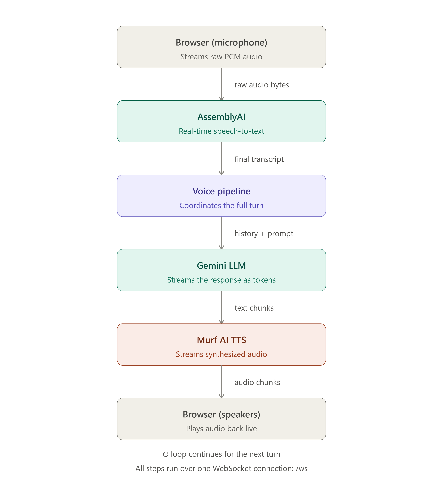

# 🎙️ Lady Victoria — AI Voice Chat Agent

A real-time, voice-to-voice conversational AI agent built with FastAPI. Speak into your browser and Lady Victoria — a distinguished royal-butler persona — listens, thinks, and replies back in her own voice, streamed to you as she generates it.

## Live Demo

[Try the AI Voice Agent](https://ai-voice-agent-pc67.onrender.com/)

The full pipeline runs over a single WebSocket connection:

**Your voice → AssemblyAI (Speech-to-Text) → Google Gemini (LLM, streamed) → Murf AI (Text-to-Speech, streamed) → Your speakers**




---

## ✨ Features

- 🎙️ **Real-time voice input** — continuous audio streamed to the backend over WebSocket, transcribed live by AssemblyAI's v3 streaming API with automatic turn detection (it knows when you've finished speaking)
- ⚡ **Streaming LLM responses** — Gemini responses are streamed token-by-token via Server-Sent Events, so Lady Victoria starts "speaking" before she's finished "thinking"
- 🔊 **Streaming, buffered TTS** — text is chunked and sent to Murf AI's WebSocket API as it arrives from the LLM; the audio comes back in a buffered queue for smooth, low-latency playback
- 💬 **Per-session chat memory** — each WebSocket connection gets its own session with rolling conversation history (last 10 messages) so the agent has context
- 🌐 **Optional live web search** — if a Tavily API key is supplied and the user's message contains a live-info keyword (weather, stock, news, score, price, etc.), the agent pulls fresh search results into the prompt before answering
- 👑 **Lady Victoria persona** — a royal-butler character baked into the system prompt: elegant, concise, addresses you as "My Lord"/"My Lady"
- 🎛️ **Runtime API key configuration** — no server-side `.env` needed; you paste your API keys into the web UI and they're held in memory for your session
- 🖥️ **Multi-page flow** — a dedicated setup page (`/`) for entering keys, and a separate session page (`/session`) with a mic-volume-reactive equalizer, live chat transcript, and mic pause / end conversation controls
- 📊 **Structured logging** — every stage of the pipeline (STT session, Gemini request timing, Murf connection, WebSocket lifecycle) is logged for debugging

---

## 🛠️ Technology Stack

| Layer | Technology |
|---|---|
| Backend framework | FastAPI + Uvicorn, WebSocket-based |
| Speech-to-Text | AssemblyAI v3 Streaming API (turn detection, 16kHz) |
| Language model | Google Gemini (`generateContent` / `streamGenerateContent`, SSE) |
| Text-to-Speech | Murf AI WebSocket streaming API |
| Web search (optional) | Tavily API |
| Frontend | Vanilla JavaScript, Web Audio API, native WebSocket |
| Templates | Jinja2 (two pages: setup + session) |
| HTTP client | aiohttp |
| Deployment | Render (`render.yaml` included) |

---

## 📋 Prerequisites

- Python 3.11+
- API keys for the services you want to use (entered in the browser UI at runtime — no `.env` file required):
  - **Google Gemini API** key — required
  - **Murf AI API** key — required
  - **AssemblyAI API** key — required
  - **Tavily API** key — optional, only needed for live web search

---

## 🚀 Quick Start

### 1. Clone the repository

```bash
git clone https://github.com/satya-2810/AI-Voice-Agent.git
cd AI-Voice-Agent
```

### 2. Set up a virtual environment

```bash
python -m venv venv

# Windows
venv\Scripts\activate

# macOS/Linux
source venv/bin/activate
```

### 3. Install dependencies

```bash
pip install -r requirements.txt
```

### 4. Run the application

```bash
uvicorn app:app --reload
```

By default this serves on `http://127.0.0.1:8000`.

### 5. Open it in your browser and add your keys

- Go to `http://127.0.0.1:8000` — this is the **setup page**
- Paste your Gemini, Murf, AssemblyAI (and optionally Tavily) keys, then click **Save keys** — this calls `POST /config` and stores them in memory for the running server
- On success you're taken to `/session`, the **live agent page**
- Click **Start session** and talk — Lady Victoria will transcribe, respond, and speak back
- Use **Stop mic** to pause listening without ending the conversation, or **End conversation** to finish and clear the chat

> Keys are kept in server memory only for the running process (`user_api_keys` in `app.py`) — they are not written to disk or committed anywhere.

---

## 📁 Project Structure

```plaintext
ai-voice-agent/
├── app.py                          # FastAPI app: routes, WebSocket endpoint, AssemblyAI wiring
├── config.py                       # Static settings (base URLs, static/template dirs, logging)
├── requirements.txt                # Python dependencies
├── render.yaml                     # Render.com deployment config
├── services/
│   ├── chat_service.py             # In-memory per-session chat history
│   ├── llm_service.py              # Gemini integration: persona, streaming, web-search trigger
│   └── tts_service.py              # Murf AI WebSocket integration with audio buffering
├── managers/
│   ├── connection_manager.py       # Tracks active WebSocket connections by session ID
│   └── session_manager.py          # Per-connection session state (ClientSession dataclass)
├── pipelines/
│   └── voice_pipeline.py           # Orchestrates STT transcript → LLM stream → TTS stream
├── templates/
│   ├── index.html                  # Setup page: API key form
│   └── session.html                # Session page: ready / active / ended screens
├── static/
│   ├── style.css                   # Shared "quiet luxury concierge" theme for both pages
│   ├── setup.js                    # Setup page: save keys, redirect to /session
│   └── session.js                  # Session page: equalizer, chat, WebSocket + audio pipeline
└── assets/                         # README screenshots/diagrams
```

---

## 🏗️ Architecture Overview

The app is organized into clear layers:

- **`app.py`** — the FastAPI entrypoint. It serves the two page routes (`/` and `/session`) and owns the `/ws` WebSocket handler, which receives raw audio bytes from the browser and feeds them into an AssemblyAI `StreamingClient`.
- **`managers/`** — `ConnectionManager` tracks which WebSocket belongs to which session; `SessionManager` creates a lightweight `ClientSession` (holds an `event_queue`, a `llm_triggered` flag to prevent duplicate LLM calls, and the caller's Tavily key).
- **`services/`** — one class per external API:
  - `ChatService` keeps a rolling in-memory conversation history per session
  - `LLMService` builds Gemini-formatted message payloads, injects the Lady Victoria persona on the first turn, optionally enriches the prompt with Tavily search results, and streams the response back as text chunks
  - `TTSService` opens a Murf WebSocket, streams text into it as it's generated, and yields back base64-encoded audio chunks through a small internal buffer for smoother playback
- **`pipelines/voice_pipeline.py`** — the glue: takes a finished transcript, saves it to chat history, streams it through `LLMService`, forwards LLM text chunks to the client for live captioning, batches that same text into Murf for TTS, and streams the resulting audio chunks back to the browser over the WebSocket — all concurrently using `asyncio` tasks and queues.
- **Frontend pages** — `index.html`/`setup.js` handle key collection only; `session.html`/`session.js` handle the entire live-agent experience (mic capture, volume-reactive equalizer, chat rendering, playback) once keys are confirmed saved.

### Data flow

```
Browser: / (setup) → POST /config → redirect → /session (ready)
                                                    │ Start session
                                                    ▼
Browser mic → PCM audio (WS) → AssemblyAI StreamingClient
                                        │ (turn-detected transcript)
                                        ▼
                              VoicePipeline.stream_llm_and_tts()
                                        │
                    ┌───────────────────┼────────────────────┐
                    ▼                                         ▼
         LLMService.stream_chat_response()          (buffered into ~20-char/sentence chunks)
                    │                                         │
                    ▼                                         ▼
        WS: llm_chunk / llm_final_response          TTSService → Murf WS → base64 audio chunks
                                                                │
                                                                ▼
                                                  WS: tts_audio_chunk / tts_done → browser playback
```

---

## 🎯 API Reference

| Method | Path | Description |
|---|---|---|
| `GET` | `/` | Serves the API key setup page |
| `GET` | `/session` | Serves the live voice agent page |
| `GET` | `/health` | Health check — reports which API keys are set and active session count |
| `GET` | `/debug/llm` | Sends a test prompt to Gemini and returns the raw response (useful for verifying your Gemini key works) |
| `POST` | `/config` | Accepts `{ geminiKey, murfKey, assemblyKey, tavilyKey }` and stores them in memory for the running server |
| `WS` | `/ws` | Main voice loop: send raw PCM audio bytes in, receive JSON events out (`partial_transcription`, `final_transcription`, `llm_chunk`, `llm_final_response`, `tts_audio_chunk`, `tts_done`, `error`) |

### Example: `GET /health` response

```json
{
  "status": "healthy",
  "service": "AI Voice Chat Agent",
  "version": "1.0.0",
  "api_keys": {
    "gemini": true,
    "murf": true,
    "assemblyai": true,
    "tavily": false
  },
  "session_count": 1
}
```

---

## 👑 The Lady Victoria Persona

The system prompt (in `services/llm_service.py`) instructs Gemini to respond as a distinguished royal butler:

- Elegant, polite, concise phrasing
- Addresses the user as "My Lord" or "My Lady"
- For voice replies specifically: kept under ~20 words / 2 short sentences, so responses feel conversational rather than like a wall of text being read aloud

---

## 🔍 Notes on the Web Search Feature

Tavily search is **best-effort and silent**: if no Tavily key was submitted via `/config`, or the search call fails for any reason, `LLMService.search_web()` simply returns an empty string and the LLM answers from its own knowledge instead — no error is surfaced to the user in that case. Search is only triggered when the latest user message contains one of a fixed set of live-info keywords (`weather`, `stock`, `news`, `today`, `score`, `bitcoin`, etc.).

---

## ⚠️ Known Limitations

- API keys live in server memory only (`user_api_keys` global dict in `app.py`) — they are **not** persisted, and are shared across all connected clients on a given server process rather than being per-user. This is fine for local/single-user use but is not a multi-tenant-safe design.
- Chat history (`ChatService`) is also in-memory and is lost on server restart.
- No authentication on any endpoint — anyone who can reach the server can set the API keys and use the voice agent, and anyone can navigate directly to `/session`.

---

## 🙏 Acknowledgments

- **AssemblyAI** — real-time speech recognition
- **Google Gemini** — language model
- **Murf AI** — streaming text-to-speech
- **Tavily** — web search API
- **FastAPI** — web framework

---

## 🌟 Support

If you find this project useful:

- ⭐ Star the repo
- 🍴 Fork it and contribute
- 💬 Open an issue for bugs or feature ideas
