# 🎤 AI Voice Chat Agent

A sophisticated conversational AI agent that supports voice input and output, built with FastAPI and modern Python practices. The agent processes speech through a complete pipeline: Speech-to-Text → Language Model → Text-to-Speech.

 

## ✨ Features

- 🎙️ **Voice Input**: Record audio directly in the browser
- 🗣️ **Voice Output**: High-quality text-to-speech responses
- 💬 **Chat Memory**: Maintains conversation context across interactions
- 🏗️ **Modern Architecture**: Clean, maintainable code with service separation
- 📊 **Comprehensive Logging**: Detailed logs for debugging and monitoring

## 🛠️ Technology Stack

- **Backend**: FastAPI with Pydantic models
- **Speech-to-Text**: AssemblyAI
- **Language Model**: Google Gemini Pro
- **Text-to-Speech**: Murf AI
- **Frontend**: JavaScript

## 📋 Prerequisites

- Python 3.11+
- API Keys for:
  - Google Gemini API
  - Murf AI API
  - AssemblyAI API

## 🚀 Quick Start

### 1. Clone the Repository

```bash
git clone https://github.com/yourusername/ai-voice-chat-agent.git
cd ai-voice-chat-agent
```

### 2. Set Up Environment

```bash
# Create virtual environment
python -m venv venv
source venv/Scripts/activate  # On Windows: venv\Scripts\activate

# Install dependencies
pip install -r requirements.txt
```

### 3. Configure Environment Variables

```bash
# Copy environment template
cp .env.example .env

# Edit .env with your API keys
GEMINI_API_KEY=your_gemini_api_key_here
MURF_API_KEY=your_murf_api_key_here
ASSEMBLYAI_API_KEY=your_assemblyai_api_key_here
```

### 4. Run the Application

```bash

# With uvicorn
uvicorn app:app --reload
```

## 📁 Project Structure

```plaintext
voice-agent/
├── app.py                 # Main FastAPI application
├── config.py              # Configuration management
├── run.py                 # Development server runner
├── requirements.txt       # Python dependencies
├── .env.example           # Environment variables template
├── models/
│   ├── __init__.py
│   └── schemas.py         # Pydantic models
├── services/
│   ├── __init__.py
│   ├── stt_service.py     # Speech-to-Text service
│   ├── llm_service.py     # Language Model service
│   ├── tts_service.py     # Text-to-Speech service
│   └── chat_service.py    # Chat history management
├── utils/
│   ├── __init__.py
│   └── logger.py          # Logging configuration
├── static/
│   ├── script.js          # Frontend JavaScript
│   └── style.css          # Stylesheets
├── templates/
│   └── index.html         # HTML template
└── temp/                  # Temporary audio files
```

## 🏗️ Architecture Overview

The application follows a clean architecture pattern with separation of concerns:

### Services Layer

- **STTService**: Handles AssemblyAI speech-to-text operations
- **LLMService**: Manages Gemini API interactions
- **TTSService**: Processes Murf AI text-to-speech
- **ChatService**: Maintains conversation history

## 🔄 Data Flow

```mermaid
graph TD
    A[🎙️ Voice Input] --> B[📤 Upload Audio]
    B --> C[🎯 Speech-to-Text]
    C --> D[💾 Save to History]
    D --> E[🤖 Generate Response]
    E --> F[💾 Save Response]
    F --> G[🔊 Text-to-Speech]
    G --> H[📱 Return Audio + Text]
```



## 🎯 Usage Examples

### Voice Interaction

1. Click "🎤 Start Recording"
2. Speak your message
3. Click "⏹ Stop Recording"
4. Receive AI response with audio playback

### Text Query (API)

```bash
curl -X POST "http://localhost:8000/llm/query" \
  -H "Content-Type: application/json" \
  -d '{"text": "Hello, how are you today?"}'
```

### Get Session History

```bash
curl -X GET "http://localhost:8000/sessions/123456/history"
```

### Example Responses

#### Successful Chat Response

```json
{
  "text": "Hello! How can I help you today?",
  "audio_base64": "UklGRiQAAABXQVZFZm10...",
  "session_id": "1234567890"
}
```

#### Error Response

```json
{
  "error": "Transcription failed",
  "detail": "No speech detected in audio",
  "timestamp": "2024-01-15T10:30:00Z"
}
```

## 🙏 Acknowledgments

- **AssemblyAI** for speech recognition services
- **Google Gemini** for language model capabilities
- **Murf AI** for text-to-speech synthesis
- **FastAPI** for the excellent web framework

## 🌟 Support

If you find this project helpful, please consider:

- ⭐ Giving it a star on GitHub
- 🍴 Forking and contributing
- 📢 Sharing with the community
- 💬 Opening issues for bugs or features
